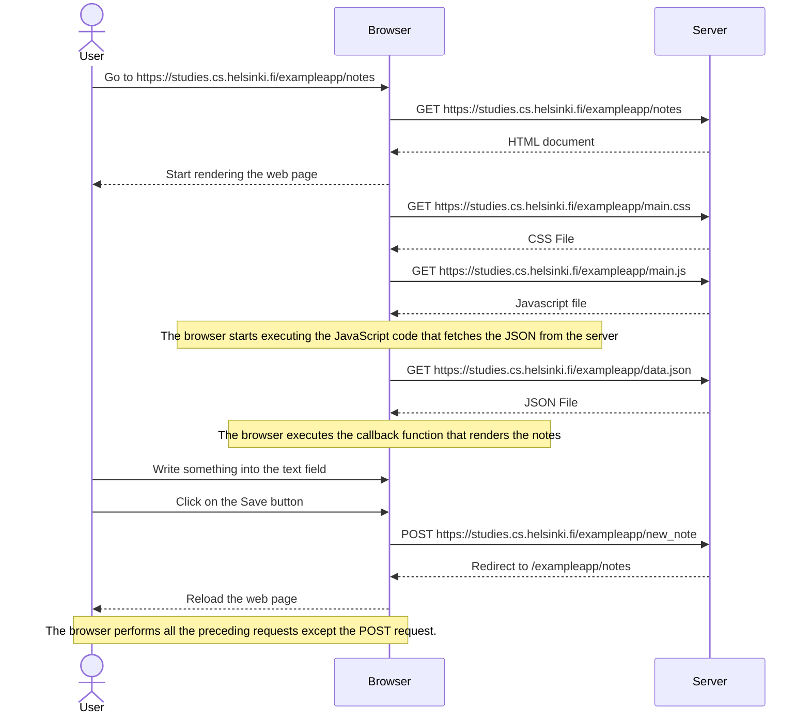

```mermaid
sequenceDiagram
    actor user as User
    participant browser as Browser
    participant server as Server

    user ->> browser: Go to https://studies.cs.helsinki.fi/exampleapp/notes
    browser ->> server: GET https://studies.cs.helsinki.fi/exampleapp/notes
    server -->> browser: HTML document
    browser -->> user: Start rendering the web page
    browser ->> server: GET https://studies.cs.helsinki.fi/exampleapp/main.css
    server -->> browser: CSS File
    browser ->> server: GET https://studies.cs.helsinki.fi/exampleapp/main.js
    server -->> browser: Javascript file
    Note over browser: The browser starts executing the JavaScript code that fetches the JSON from the server
    browser ->> server: GET https://studies.cs.helsinki.fi/exampleapp/data.json
    server -->> browser: JSON File
    Note over browser: The browser executes the callback function that renders the notes

    user ->> browser: Write something into the text field
    user ->> browser: Click on the Save button
    browser ->> server: POST https://studies.cs.helsinki.fi/exampleapp/new_note
    server -->> browser: Redirect to /exampleapp/notes
    browser -->> user: Reload the web page
    Note over user,browser: The browser performs all the preceding requests except the POST request.
```