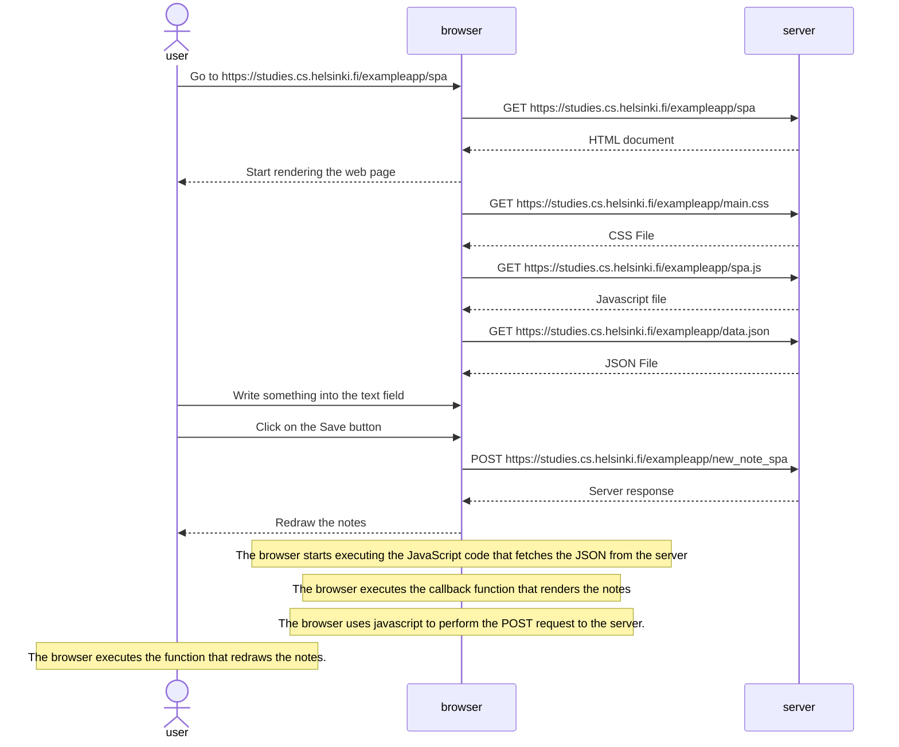

```mermaid
sequenceDiagram
    actor user
    participant browser
    participant server

    user ->> browser: Go to https://studies.cs.helsinki.fi/exampleapp/spa
    browser ->> server: GET https://studies.cs.helsinki.fi/exampleapp/spa
    server -->> browser: HTML document
    browser -->> user: Start rendering the web page
    browser ->> server: GET https://studies.cs.helsinki.fi/exampleapp/main.css
    server -->> browser: CSS File
    browser ->> server: GET https://studies.cs.helsinki.fi/exampleapp/spa.js
    server -->> browser: Javascript file
    browser ->> server: GET https://studies.cs.helsinki.fi/exampleapp/data.json
    server -->> browser: JSON File
    user ->> browser: Write something into the text field
    user ->> browser: Click on the Save button
    browser ->> server: POST https://studies.cs.helsinki.fi/exampleapp/new_note_spa
    server -->> browser: Server response
    browser -->> user: Redraw the notes

    note over browser: The browser starts executing the JavaScript code that fetches the JSON from the server
    note over browser: The browser executes the callback function that renders the notes
    note over browser: The browser uses javascript to perform the POST request to the server.
    note over user: The browser executes the function that redraws the notes.
```