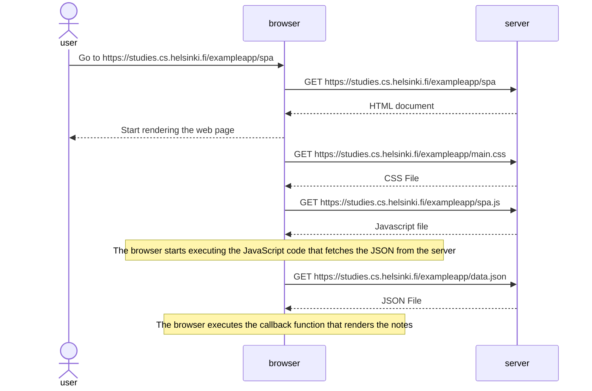

```mermaid
sequenceDiagram
    actor user
    participant browser
    participant server

    user ->> browser: Go to https://studies.cs.helsinki.fi/exampleapp/spa

    browser ->> server: GET https://studies.cs.helsinki.fi/exampleapp/spa
    server -->> browser: HTML document
    browser -->> user: Start rendering the web page

    browser ->> server: GET https://studies.cs.helsinki.fi/exampleapp/main.css
    server -->> browser: CSS File

    browser ->> server: GET https://studies.cs.helsinki.fi/exampleapp/spa.js
    server -->> browser: Javascript file
    Note over browser: The browser starts executing the JavaScript code that fetches the JSON from the server

    browser ->> server: GET https://studies.cs.helsinki.fi/exampleapp/data.json
    server -->> browser: JSON File
    Note over browser: The browser executes the callback function that renders the notes
```