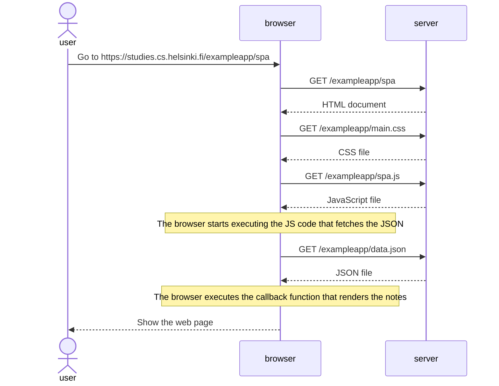

```mermaid
sequenceDiagram
    actor user
    participant browser
    participant server

    user ->> browser: Go to https://studies.cs.helsinki.fi/exampleapp/spa
    browser ->> server: GET /exampleapp/spa
    server -->> browser: HTML document
    browser ->> server: GET /exampleapp/main.css
    server -->> browser: CSS file
    browser ->> server: GET /exampleapp/spa.js
    server -->> browser: JavaScript file
    Note over browser: The browser starts executing the JS code that fetches the JSON
    browser ->> server: GET /exampleapp/data.json
    server -->> browser: JSON file
    Note over browser: The browser executes the callback function that renders the notes
    browser -->> user: Show the web page
```